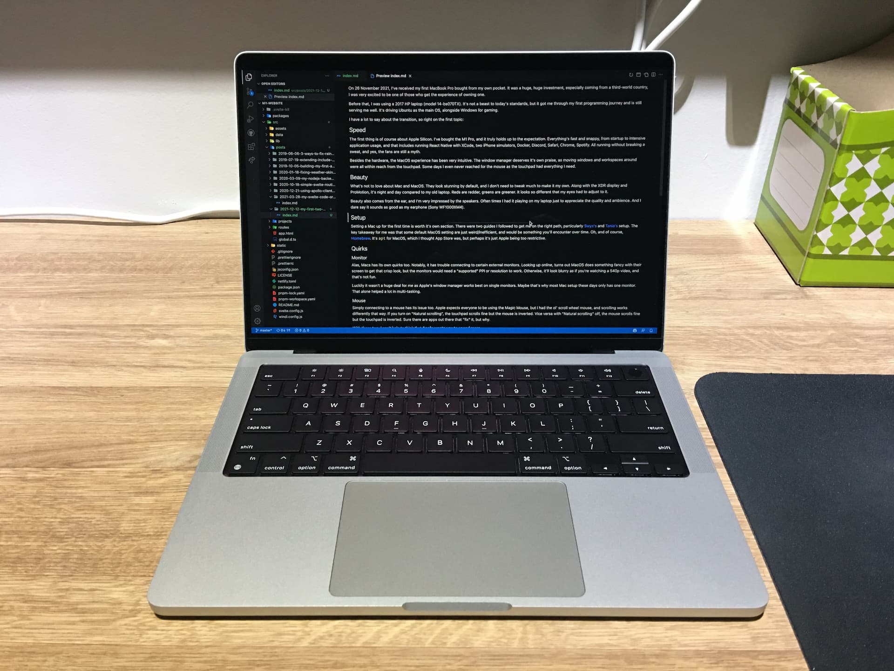

On 26 November 2021, I've received my first MacBook Pro bought from my own pocket. It was a huge, huge investment, especially coming from a third-world country, I was very excited to be one of those who get the experience of owning one.

Before that, I was using a 2017 HP laptop (model 14-bs070TX). It's not a beast to today's standards, but it got me through my first programming journey and is still serving me well. It's driving Ubuntu as the main OS, alongside Windows for gaming.

I have a lot to say about the transition, so right on the first topic:

## Speed

The first thing is of course about Apple Silicon. I've bought the M1 Pro, and it truly holds up to the expectation. Everything's fast and snappy, from startup to intensive application usage, and that includes running React Native with XCode, two iPhone simulators, Docker, Discord, Safari, Chrome, Spotify. All running without breaking a sweat, and yes, the fans are still a myth.

Besides the hardware, the macOS experience has been very intuitive. The window manager deserves its own praise, as moving windows and workspaces around were all within reach from the touchpad. Some days, I never reached for the mouse as the touchpad had everything I needed.

## Beauty

What's not to love about Mac and macOS. They look stunning by default, and I don't need to tweak much to make it my own. Along with the XDR display and ProMotion, it's night and day compared to my old laptop. Reds are redder, greens are greener. It looks so different that my eyes had to adjust to it.

Beauty also comes from the ear, and I'm very impressed by the speakers. Often times I had it playing on my laptop just to appreciate the quality and ambience. And I dare say it sounds as good as my earphone (Sony WF1000XM4).

## Setup

Setting a Mac up for the first time worths its own section. I followed two guides to get me on the right path, particularly [Swyx's](https://www.swyx.io/new-mac-setup-2021) and [Tania's](https://www.taniarascia.com/setting-up-a-brand-new-mac-for-development) setup. The key takeaway for me was that some default macOS setting are just odd, and they would be something you'll realize over time.

Oh, and of course, [Homebrew](https://brew.sh) is a must-have. It's `apt` for macOS, which I thought App Store was supposed to be, but perhaps it's just Apple being too restrictive. Otherwise, Homebrew has been nice and familiar for managing my applications.

## Quirks

### Monitor

Alas, Macs has its own quirks too. Notably, it has trouble connecting to certain external monitors. Looking up online, turns out macOS does something fancy with their screen to get that crisp look, but the monitors would need a "supported" PPI or resolution to work. Otherwise, it'll look blurry as if you're watching a 540p video, and that's not fun.

Luckily it wasn't a huge deal for me as Apple's window manager works best on single screens, and I have been rocking with my laptop only. Maybe that's why most Mac setups these days only have one main screen.

### Mouse

Simply connecting a mouse has its issues too. Apple expects everyone to be using the Magic Mouse, but I had the ol' scroll wheel mouse, and scrolling works differently that way. If you turn on "Natural scrolling", the touchpad scrolls fine but the mouse is inverted. Vice versa with "Natural scrolling" off, the mouse scrolls fine but the touchpad is inverted. Sure there are apps out there that "fix" it, but why.

With these two, I can't help to think that **Apple wants you to spend more.**

### M1

It has been a year since M1 and ARM became mainstream, though many software has caught up on it, some aren't yet. I was prepared for it, but I can't deny that some hours have been spent debugging issues in M1, and finally resorting to Rosetta.

## Epilogue

Quirks aside, I still absolutely love it. It made me more productive than before, and there isn't any aspect I thought my old laptop did better. Hope this bad boy gets me 5 years before an upgrade is needed.

