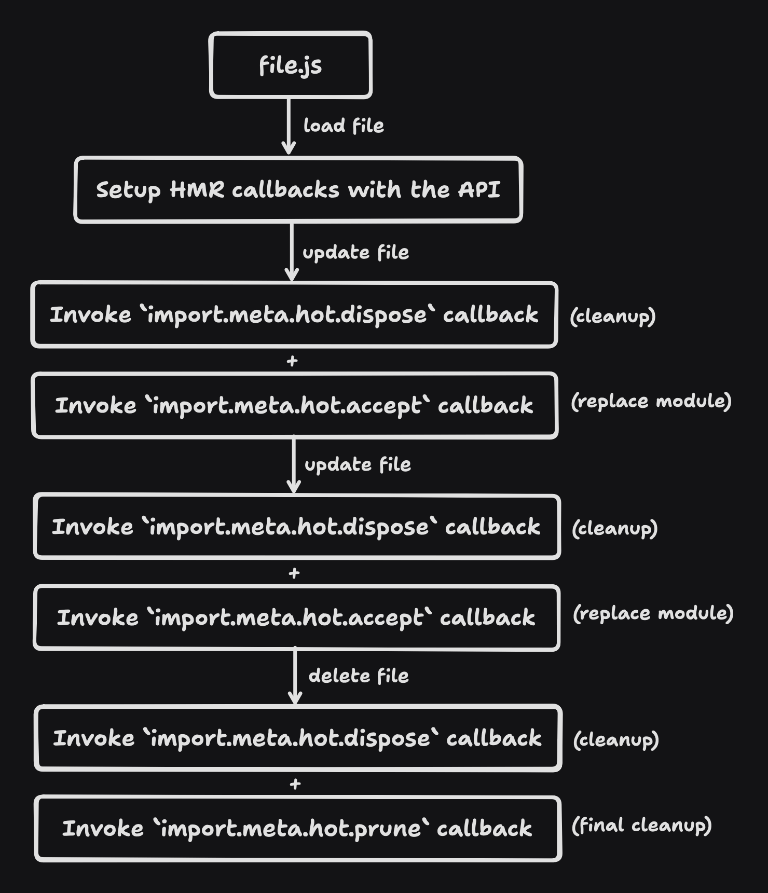
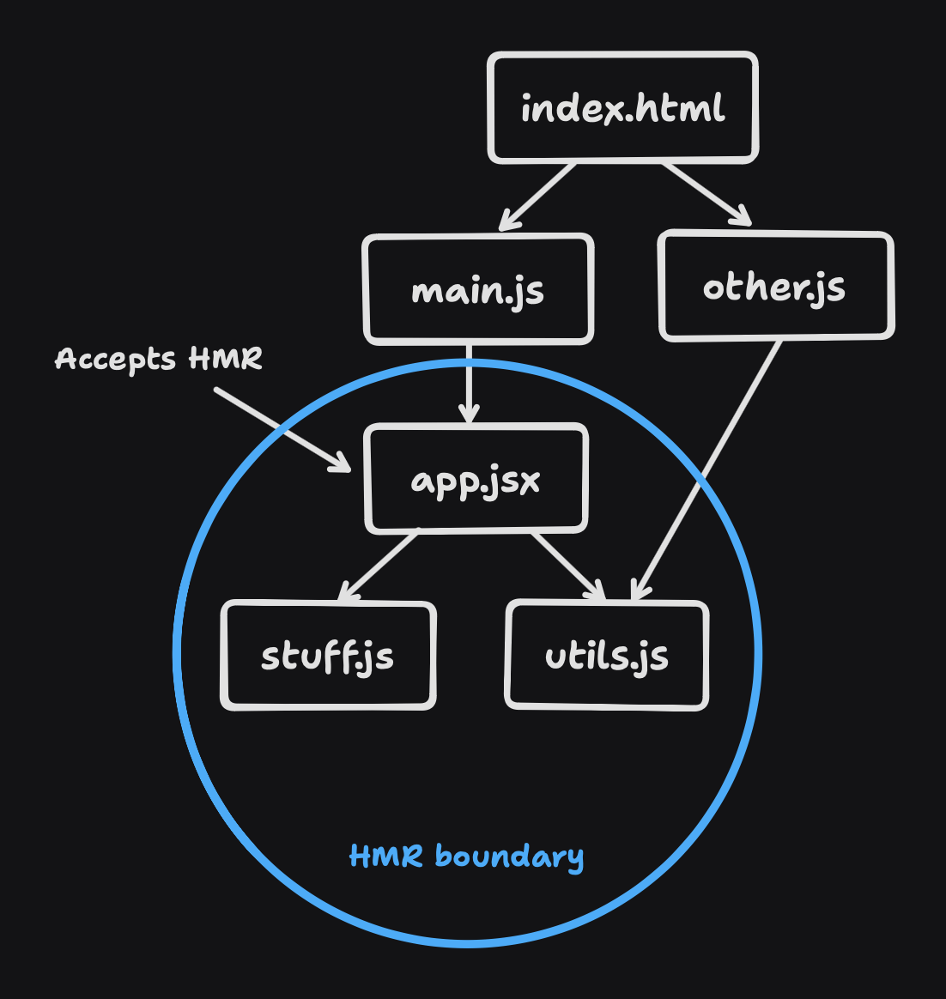
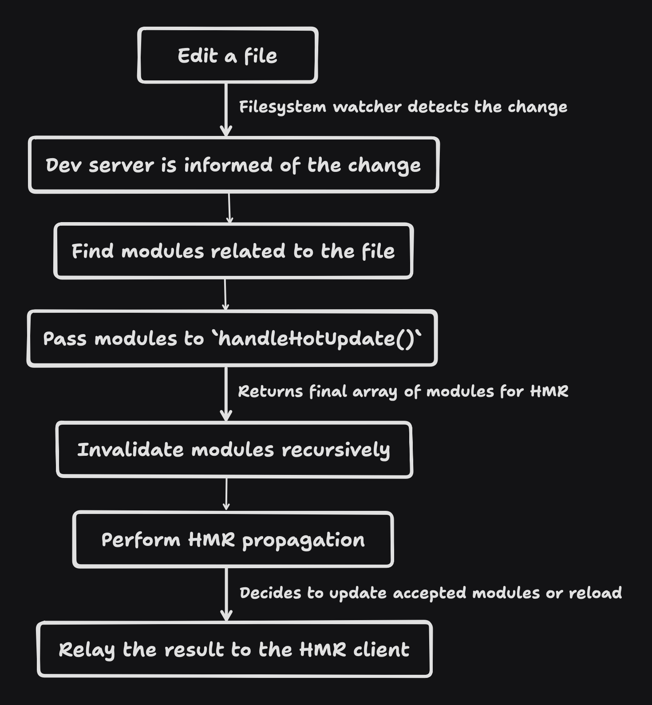
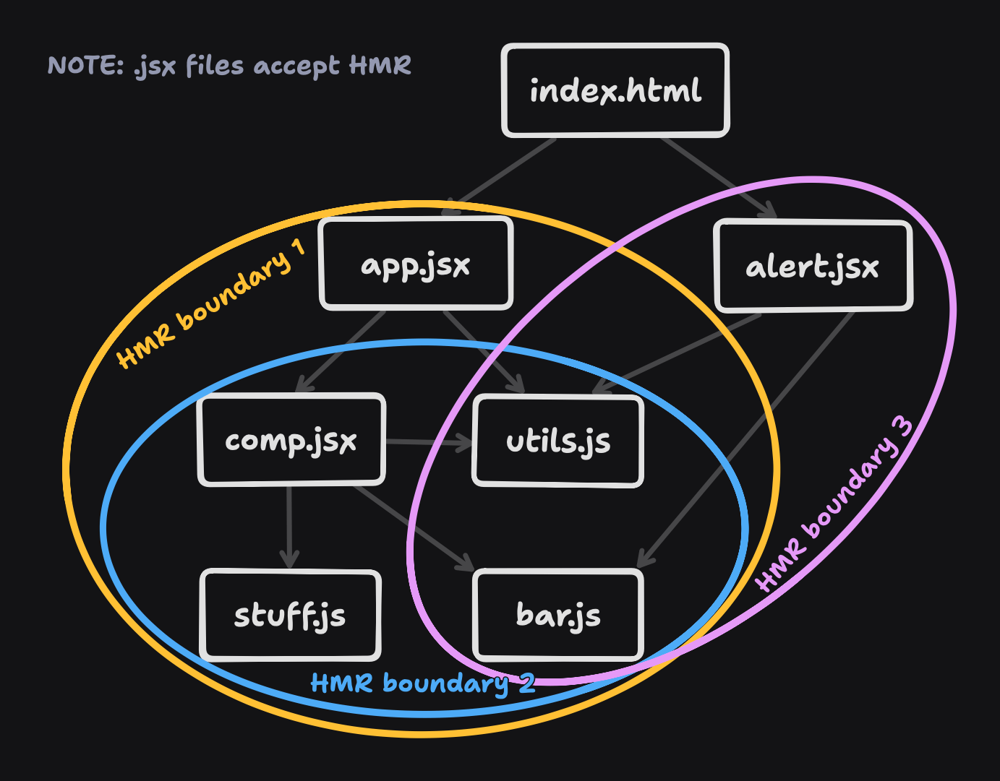
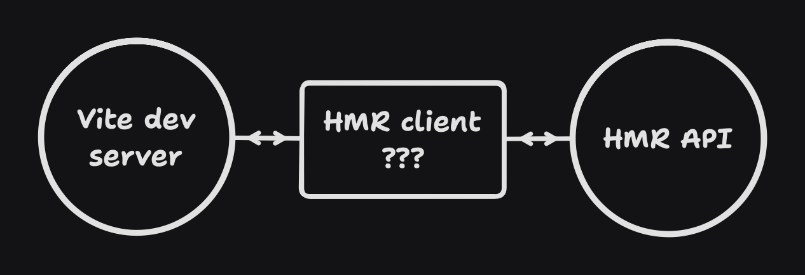

If you've built projects with Vite, chances are you've also used Hot Module Replacement (HMR). HMR allows you to update your code without having to refresh the page, such as editing a component markup or adjusting styles, the changes are immediately reflected in the browser, which enables faster code iteration and improved developer experience.

While HMR is also a feature in other bundlers like Webpack and Parcel, in this blog we'll dig deeper into how it works in Vite specifically. Generally other bundlers should also work similarly.

To preface, HMR is _not_ easy and certain topics may require some time to digest, but I hope to have piqued your interest! On this page, you'll learn:

<!-- toc -->

> A quick summary in video form is also available [here](https://gitnation.com/contents/hot-module-replacement-is-easy).

## What it takes to replace modules

In essence, HMR is about replacing modules on the fly while your app is running. Most bundlers use ECMAScript modules (ESM) as the _module_ because it's easier to analyze the imports and exports, which helps to inform how a replacement in one module will affect other related modules.

A module usually has access to HMR lifecycle APIs to handle when the old module gets thrown away, and when the new module comes in place. In Vite, you have:

- [`import.meta.hot.accept()`](https://vite.dev/guide/api-hmr.html#hot-accept-cb)
- [`import.meta.hot.dispose()`](https://vite.dev/guide/api-hmr.html#hot-dispose-cb)
- [`import.meta.hot.prune()`](https://vite.dev/guide/api-hmr.html#hot-prune-cb)
- [`import.meta.hot.invalidate()`](https://vite.dev/guide/api-hmr.html#hot-invalidate-message-string)

On a high-level, they work like this:

<p class="text-center">
  
<p/>

<!-- NOTE: There's a bug where the last dispose before prune is not called -->

It's also important to note that you need to use these APIs for HMR to work. For example, Vite uses these APIs for CSS files out-of-the-box, but for other files like Vue and Svelte, you can use a Vite plugin that will use these HMR APIs. Or manually if needed. Otherwise, updates to files will result in a full page reload by default.

With that aside, let's take a deeper look into how these APIs work!

### `import.meta.hot.accept()`

When you attach a callback with `import.meta.hot.accept()`, the callback will be in-charge of replacing the old module with the new one. A module that uses this API is also known as an "accepted module".

An accepted module creates a "HMR boundary". A HMR boundary contains the module itself and all of its imported modules recursively. The accepted module is also the "root" of the HMR boundary as the boundary is usually in a graph-like structure.

<p class="text-center">
  
<p/>

An accepted module can also be narrowed down as a "self-accepted module" depending on how the HMR callback is attached. They are two function signatures for `import.meta.hot.accept`:

1. `import.meta.hot.accept(cb: Function)` - Accepts changes from itself
2. `import.meta.hot.accept(deps: string | string[], cb: Function)` - Accepts changes from imported modules

If the first signature is used, it is known as a self-accepted module. The differentiation is important for [HMR propagation](#hmr-propagation), which we'll talk about later.

Here's how they can be used:

```js
export let data = [1, 2, 3]

if (import.meta.hot) {
  import.meta.hot.accept((newModule) => {
    // Replace the old value with the new one
    data = newModule.data
  })
}
```

```js
import { value } from './stuff.js'

document.querySelector('#value').textContent = value

if (import.meta.hot) {
  import.meta.hot.accept(['./stuff.js'], ([newModule]) => {
    // Re-render with the new value
    document.querySelector('#value').textContent = newModule.value
  })
}
```

### `import.meta.hot.dispose()`

When an accepted module or a module that's accepted by others gets replaced with a new one, or is being removed, we can perform cleanup with `import.meta.hot.dispose()`. This allows us to clean up any side-effects that the old module has created, such as removing event listeners, clearing timers, or resetting state.

Here's an example of the API:

```js
globalThis.__my_lib_data__ = {}

if (import.meta.hot) {
  import.meta.hot.dispose(() => {
    // Reset global state
    globalThis.__my_lib_data__ = {}
  })
}
```

<!-- NOTE: There's a weird behavior where `dispose()` is only called for the accepted module, or the module that's directly accepted by its importer. If there's a deep import chain and you updated a leaf module, all modules's `dispose()` callback will not be called. Only the accepted module, or the module that's directly accepted by its importer works. -->

### `import.meta.hot.prune()`

When a module is to be removed from the runtime entirely, e.g. a file is deleted, we can perform the final cleanup with `import.meta.hot.prune()`. This is similar to `import.meta.hot.dispose()`, but it's only called once when the module is removed.

Internally, Vite prunes modules at a different stage through import analysis (A phase that analyzes the imports of a module), as the only time we can know that a module is no longer used is when it's no longer imported by any other modules.

Here's an example of Vite using the API for CSS HMR:

```js
// Import utilities to update/remove style tags in the HTML
import { updateStyle, removeStyle } from '/@vite/client'

updateStyle('/src/style.css', 'body { color: red; }')

if (import.meta.hot) {
  // Empty accept callback is we want to accept, but we don't have to do anything.
  // `updateStyle` will automatically get rid of the old style tag.
  import.meta.hot.accept()
  // Remove style when the module is no longer used
  import.meta.hot.prune(() => {
    removeStyle('/src/style.css')
  })
}
```

### `import.meta.hot.invalidate()`

Unlike the above APIs, `import.meta.hot.invalidate()` is an action rather than a lifecycle hook. You'd often use it inside `import.meta.hot.accept` where during runtime you may later realize that the module cannot be updated safely and you need to bail out.

When this gets called, the Vite server will be informed of the invalidation as if the module has been updated. [HMR propagation](#hmr-propagation) will be executed again to figure out if any of its importers recursively can accept this change instead.

Here's an example of the API:

```js
export let data = [1, 2, 3]

if (import.meta.hot) {
  import.meta.hot.accept((newModule) => {
    // If the `data` export is deleted or renamed
    if (!(data in newModule)) {
      // Bail out and invalidate the module
      import.meta.hot.invalidate()
    }
  })
}
```

### Other HMR APIs

The [Vite HMR documentation](https://vite.dev/guide/api-hmr.html) covers many more APIs. However, they are not crucial to understanding how HMR works fundamentally so we'll skip them for now, but we'll return to them when we discuss about the [HMR client](#the-hmr-client) later.

## From the start

We've learned about the HMR APIs and how they allow us to replace and manage modules. But there's still a missing piece: How do we know when to replace a module? HMR usually happens after editing a file, but what comes after that?

At a glance, it goes something like this:

<p class="text-center">
  
<p/>

Let's step through them below.

### Editing a file

HMR starts when you edit a file and save it. A filesystem watcher like [chokidar](https://github.com/paulmillr/chokidar) will detect the change and relay this edited file path to the next step.

### Processing edited modules

The Vite dev server is informed of the edited file path. The file path is then used to find its related modules in the module graph. It's important to note that a "file" and "module" are two distinct concepts, where a file may correspond to one or many modules. For example, a Vue file can be compiled to a JavaScript module, and a related CSS module.

The modules are then passed on to Vite plugins' `handleHotUpdate()` hook for further processing. They can choose to filter or extend upon the array of modules. The final modules when then be passed on to the next step.

Here are some plugin examples:

```js
// Example: filter out array of modules
function vuePlugin() {
  return {
    name: 'vue',
    handleHotUpdate(ctx) {
      if (ctx.file.endsWith('.vue')) {
        const oldContent = cache.get(ctx.file)
        const newContent = await ctx.read()
        // If only the style has changed when editing the file, we can filter
        // out the JS module and only trigger the CSS module for HMR.
        if (isOnlyStyleChanged(oldContent, newContent)) {
          return ctx.modules.filter(m => m.url.endsWith('.css'))
        }
      }
    }
  }
}
```

```js
// Example: extending array of modules
function globalCssPlugin() {
  return {
    name: 'global-css',
    handleHotUpdate(ctx) {
      if (ctx.file.endsWith('.css')) {
        // If a CSS file is edited, we also trigger HMR for this special
        // `virtual:global-css` module that needs to be re-transformed.
        const mod = ctx.server.moduleGraph.getModuleById('virtual:global-css')
        if (mod) {
          return ctx.modules.concat(mod)
        }
      }
    }
  }
}
```

### Module invalidation

Next, we eagerly invalidate the final array of updated modules and its importers recursively. Each modules' transformed code will be removed, and an invalidation timestamp will be attached to it. The timestamp will be used to fetch the new modules on the client-side on the next request.

### HMR propagation

The final array of updated modules will now go through HMR propagation. This is where the "magic" happens, and is often the source of confusion for why HMR doesn't work as expected.

Fundamentally, HMR propagation is about finding the [HMR boundaries](#importmetahotaccept), using the updated modules as the starting point. If all of the updated modules are within a boundary, the Vite dev server will inform the HMR client to inform the [accepted modules](#importmetahotaccept) to perform HMR. If some are not within a boundary, then a full page reload will be triggered.

To better understand how it works, let's go through this example in a case-by-case basis:

<p class="text-center">
  
<p/>

- **Scenario 1**: If `stuff.js` is updated, propagation will look at its importers recursively to find an accepted module. In this case, we'll find that `app.jsx` is an accepted module. But before we end the propagation, we need to determine if `app.jsx` can accept the change from `stuff.js`. This will depend on [how the `import.meta.hot.accept()` is called](#importmetahotaccept).
  - **Scenario 1 (a)**: If `app.jsx` is self-accepting, or it accepts the changes from `stuff.js`, we can stop the propagation here as there's no other importers from `stuff.js`. The HMR client will then inform `app.jsx` to perform HMR.

  - **Scenario 1 (b)**: If `app.jsx` does not accept this change, we'll continue propagating upwards to find an accepted module. But since there are no other accepted modules, we'll reach the "root" `index.html` file. A full page reload will be triggered.

- **Scenario 2**: If `main.js` or `other.js` is updated, propagation will look at its importers recursively again. However, there's no accepted module and we'll reach the "root" `index.html` file. As such, a full page reload will be triggered.

- **Scenario 3**: If `app.jsx` is updated, we immediately find that it's an accepted module. However, some modules may or may not be able to updated changes to itself. We are able to determine if they can update itself by checking whether they are a self-accepted module.
  - **Scenario 3 (a)**: If `app.jsx` is self-accepting, we can stop here and have the HMR client inform it to perform HMR.
  - **Scenario 3 (b)**: If `app.jsx` is not self-accepting, we'll continue propagating upwards to find an accepted module. But since they're none and we'll reach the "root" `index.html` file, a full page reload will be triggered.

- **Scenario 4**: If `utils.js` is updated, propagation will look at its importers recursively again. At first, we'll find `app.jsx` as the accepted module and will stop its propagation there (assuming **Scenario 1 (a)**). Then, we'll step on `other.js` and its importers recursively too, but there are no accepted modules and we'll reach the "root" `index.html` file. If there's at least one case that doesn't have an accepted module, a full page reload will be triggered.

If you'd like to understand some more advanced scenarios that involves multiple HMR boundaries, click on the collapsed section below:

<details>
<summary><strong>Toggle advanced scenarios</strong></summary>

Let's take this different example that involves 3 HMR boundaries from the 3 `.jsx` files:

<p class="text-center">
  
<p/>

- **Scenario 5**: If `stuff.js` is updated, propagation will look at its importers recursively to find an accepted module. We'll find that `comp.jsx` is an accepted module and handle this the same way as **Scenario 1**. To re-iterate:
  - **Scenario 5 (a)**: If `comp.jsx` is self-accepting, or it accepts the changes from `stuff.js`, we can stop propagation there. The HMR client will then inform `comp.jsx` to perform HMR.
  - **Scenario 5 (b)**: If `comp.jsx` does not accept this change, we'll continue propagating upwards to find an accepted module. We'll find `app.jsx` as the accepted module and handle this the same way as this scenario (**Scenario 5**) again! We keep doing this until we find modules that can accept the changes, or if we reach the "root" index.html and a full page reload is needed.

- **Scenario 6**: If `bar.js` is updated, propagation will look at its importers recursively and find `comp.jsx` and `alert.jsx` as accepted modules. We'll also handle these two modules the same way as **Scenario 5**. Assuming the best case where both accepted modules matches **Scenario 5 (a)**, the HMR client will inform both `comp.jsx` and `alert.jsx` to perform HMR.

- **Scenario 7**: If `utils.js` is updated, propagation will look at its importers recursively again and find all its direct importers `comp.jsx`, `alert.jsx`, and `app.jsx` as accepted modules. We'll also handle these three modules the same way as **Scenario 5**. Assuming the best case where all accepted modules matches **Scenario 5 (a)**, even though `comp.jsx` is also part of the HMR boundary of `app.jsx`, the HMR client will inform all three of them to perform HMR. _(In the future, Vite could detect this and only inform `app.jsx` and `alert.jsx`, but this is mostly an implementation detail!)_

- **Scenario 8**: If `comp.jsx` is updated, we immediately find that it's an accepted module. Similar to **Scenario 3**, we need to check whether `comp.jsx` is a self-accepting module first.
  - **Scenario 8 (a)**: If `comp.jsx` is self-accepting, we can stop here and have the HMR client inform it to perform HMR.
  - **Scenario 8 (b)**: If `comp.jsx` is not self-accepting, we can handle this the same way as **Scenario 5 (b)**.

</details>

Besides the above, there are many other edge cases not covered here as they're a little advanced, including [circular imports](https://github.com/vitejs/vite/pull/14867), [partial accepting modules](https://github.com/vitejs/vite/discussions/13811), [only CSS importers](https://github.com/vitejs/vite/pull/3929), etc. However, you can revisit them when you're more familiar with the whole flow!

At the end, the result of HMR propagation is whether a full page reload is needed, or HMR updates should be applied in the client.

### What's left

In simple cases where a full reload is needed, a message will be sent to the HMR client to reload the page. If there are modules that can be hot-updated, the array of accepted modules during HMR propagation will be sent to the HMR client, where it'll trigger the right [HMR APIs we discussed above](#what-it-takes-to-replace-modules) so that HMR is performed.

But how does this HMR client work anyways?

## The HMR client

In a Vite app, you might notice a special script added in the HTML that requests `/@vite/client`. This script contains the HMR client!

The HMR client is responsible for:

1. Establishing a WebSocket connection with the Vite dev server.
2. Listening to HMR payloads from the server.
3. Providing and triggering the HMR APIs in the runtime.
4. Send back any events to the Vite dev server.

In a bigger picture, the HMR client helps glue the Vite dev server and the HMR APIs together. Let's take a look at how this glue works.

<p class="text-center">
  
<p/>

### Client initialization

Before the HMR client can receive any message from the Vite dev server, it needs to first establish a connection to it, usually through [WebSockets](https://developer.mozilla.org/en-US/docs/Web/API/WebSocket). Here's an example of setting up a WebSocket connection that handles the result of [HMR propagation](#hmr-propagation):

```js title="/@vite/client (URL)"
const ws = new WebSocket('ws://localhost:5173')

ws.addEventListener('message', ({ data }) => {
  const payload = JSON.parse(data)
  switch (payload.type) {
    case '...':
    // Handle payloads...
  }
})

// Send any events to the Vite dev server
ws.send('...')
```

We'll touch more on the payload handling in the next section.

Besides that, the HMR client also initializes some state needed to handle HMR, and exports several APIs, e.g. `createHotContext()`, for use by modules that uses the HMR APIs. For example:

```js title=app.jsx
// Injected by Vite's import-analysis plugin
import { createHotContext } from '/@vite/client'
import.meta.hot = createHotContext('/src/app.jsx')

export default function App() {
  return <div>Hello World</div>
}

// Injected by `@vitejs/plugin-react`
if (import.meta.hot) {
  // ...
}
```

The URL string passed to `createHotContext()` (also known as an "owner path") helps identify which module is able to accept changes. Internally, `createHotContext` will assign the registered HMR callbacks to a singleton of maps of "owner path to accept callbacks, dispose callback, and prune callback". We'll also get to that below!

This setup is the basis that allows modules to interact with the HMR client and execute HMR changes.

### Handling payloads from the server

After establishing the WebSocket connection, we can start handling the payloads from the Vite dev server.

```js title="/@vite/client (URL)"
ws.addEventListener('message', ({ data }) => {
  const payload = JSON.parse(data)
  switch (payload.type) {
    case 'full-reload': {
      location.reload()
      break
    }
    case 'update': {
      const updates = payload.updates
      // => { type: string, path: string, acceptedPath: string, timestamp: number }[]
      for (const update of updates) {
        handleUpdate(update)
      }
      break
    }
    case 'prune': {
      handlePrune(payload.paths)
      break
    }
    // Handle other payload types...
  }
})
```

The example above handles the result of [HMR propagation](#hmr-propagation) to either trigger a full page reload or HMR updates, based on the `full-reload` and `update` payload types respectively. And it also handles pruning when a module is no longer used.

There are more types of payloads that can come through that are not HMR-specific, but to briefly touch on them:

- `connected`: Sent when a WebSocket connection is established.
- `error`: Sent when there's an error on the server-side, and Vite can display an error overlay in the browser.
- `custom`: Sent by Vite plugins to inform the client for any events. Useful for inter-communication between the client and server.

Moving along, let's take a look at how HMR updates actually works.

### HMR update

Each [HMR boundaries](#importmetahotaccept) found during [HMR propagation](#hmr-propagation) usually correspond to a HMR update. In Vite, an update takes this signature:

```ts
interface Update {
  // The type of update
  type: 'js-update' | 'css-update'
  // The URL path of the accepted module (HMR boundary root)
  path: string
  // The URL path that is accepted (usually the same as above)
  // (We'll talk about this later)
  acceptedPath: string
  // The timestamp when the update happened
  timestamp: number
}
```

Different HMR implementations are free to re-shape the update signature however they want. In Vite, it's differentiated as a "JS update" or a "CSS update", where CSS updates are special cased to simply swap out `link` tags in the HTML when updated.

For JS updates, we need to find the corresponding module to call its `import.meta.hot.accept()` callback so that it can apply HMR on itself. Since in `createHotContext()` we had [registered the path](#client-initialization) as the first parameter, we can easily find the matching module via the update's `path`. And with the update's `timestamp`, we can also fetch the new version of the module to be passed to `import.meta.hot.accept()`. Here's how an implementation can look like:

```ts title="/@vite/client (URL)"
// Map populated by `createHotContext()`
const ownerPathToAcceptCallbacks = new Map<string, Function[]>()

async function handleUpdate(update: Update) {
  const acceptCbs = ownerPathToAcceptCallbacks.get(update.path)
  const newModule = await import(`${update.acceptedPath}?t=${update.timestamp}`)

  for (const cb of acceptCbs) {
    cb(newModule)
  }
}
```

However, remember that `import.meta.hot.accept()` has two function signatures?

- `import.meta.hot.accept(cb: Function)`
- `import.meta.hot.accept(deps: string | string[], cb: Function)`

The above implementation only works well for the first function signature (self-accepted modules), but not for the second. The second function signature's callback needs to be called only if the dependencies have updated. Internally, we can bind each callback to a set of dependencies:

```js title=app.jsx
// URL: /src/app.jsx
import { add } from './utils.js'
import { value } from './stuff.js'

if (import.meta.hot) {
  import.meta.hot.accept(...)
  // { deps: ['/src/app.jsx'], fn: ... }

  import.meta.hot.accept('./utils.js', ...)
  // { deps: ['/src/utils.js'], fn: ... }

  import.meta.hot.accept(['./stuff.js'], ...)
  // { deps: ['/src/stuff.js'], fn: ... }
}
```

And we can then use `acceptedPath` to match the dependencies and trigger the right callback function. For example, if `stuff.js` is updated, the `acceptedPath` would be `/src/stuff.js`, and `path` would be `/src/app.jsx`. This way, we can inform the owner path (`path`) that the accepted path (`acceptedPath`) has been updated, and the owner can handle its changes. We can adjust the HMR handlers as so:

```ts title="/@vite/client (URL)" {2-5,13-15}
// Map populated by `createHotContext()`
const ownerPathToAcceptCallbacks = new Map<
  string,
  { deps: string[]; fn: Function }[]
>()

async function handleUpdate(update: Update) {
  const acceptCbs = ownerPathToAcceptCallbacks.get(update.path)
  const newModule = await import(`${update.acceptedPath}?t=${update.timestamp}`)

  for (const cb of acceptCbs) {
    // Make sure to only execute callbacks that can handle `acceptedPath`
    if (cb.deps.some((deps) => deps.includes(update.acceptedPath))) {
      cb.fn(newModule)
    }
  }
}
```

But we're not done yet! Before importing the new module, we also need to make sure the old module is properly disposed of using `import.meta.hot.dispose()`.

```ts title="/@vite/client (URL)" {6,12}
// Maps populated by `createHotContext()`
const ownerPathToAcceptCallbacks = new Map<
  string,
  { deps: string[]; fn: Function }[]
>()
const ownerPathToDisposeCallback = new Map<string, Function>()

async function handleUpdate(update: Update) {
  const acceptCbs = ownerPathToAcceptCallbacks.get(update.path)

  // Call the dispose callback if there's any
  ownerPathToDisposeCallbacks.get(update.path)?.()

  const newModule = await import(`${update.acceptedPath}?t=${update.timestamp}`)

  for (const cb of acceptCbs) {
    // Make sure to only execute callbacks that can handle `acceptedPath`
    if (cb.deps.some((deps) => deps.includes(update.acceptedPath))) {
      cb.fn(newModule)
    }
  }
}
```

And with that we've pretty much implemented to bulk of the HMR client! As further exercise, you can also try to implement error handling, null owner checks, queueing parallel updates for predictability, etc, that will make the final form more robust.

### HMR pruning

As discussed in [`import.meta.hot.prune()`](#importmetahotprune), Vite internally handles HMR pruning in the "import analysis" phase. When a module is no longer imported by any other modules, the Vite dev server will send a `{ type: 'prune', paths: string[] }` payload to the HMR client where it'll independently prune the modules in the runtime.

```ts title="/@vite/client (URL)"
// Maps populated by `createHotContext()`
const ownerPathToDisposeCallback = new Map<string, Function>()
const ownerPathToPruneCallback = new Map<string, Function>()

function handlePrune(paths: string[]) {
  for (const p of paths) {
    ownerPathToDisposeCallbacks.get(p)?.()
    ownerPathToPruneCallback.get(p)?.()
  }
}
```

### HMR invalidation

Unlike the other HMR APIs, [`import.meta.hot.invalidate()`](#importmetahotinvalidate) is an action that can be called during `import.meta.hot.accept()` to bail out of HMR. In `/@vite/client`, it's as simple as sending a WebSocket message to the Vite dev server:

```ts title="/@vite/client (URL)"
// `ownerPath` comes from `createHotContext()`
function handleInvalidate(ownerPath: string) {
  ws.send(
    JSON.stringify({
      type: 'custom',
      event: 'vite:invalidate',
      data: { path: ownerPath }
    })
  )
}
```

When the Vite server receives this, it'll execute [HMR propagation](#hmr-propagation) again from its importers onwards, and the result (full reload or HMR updates) will be sent back to the HMR client.

### HMR events

While not necessary for HMR, the HMR client can also emit events in the runtime when certain payloads are received. [`import.meta.hot.on`](https://vite.dev/guide/api-hmr.html#hot-on-event-cb) and [`import.meta.hot.off`](https://vite.dev/guide/api-hmr.html#hot-off-event-cb) can be used to listen and un-listen to these events.

```js
if (import.meta.hot) {
  import.meta.hot.on('vite:invalidate', () => {
    // ...
  })
}
```

Emitting and tracking these events are very similar to how we handle the HMR callbacks above too. Taking the [HMR invalidation](#hmr-invalidation) code as example:

```ts title="/@vite/client (URL)" {1,5}
const eventNameToCallbacks = new Map<string, Set<Function>>()

// `ownerPath` comes from `createHotContext()`
function handleInvalidate(ownerPath: string) {
  eventNameToCallbacks.get('vite:invalidate')?.forEach((cb) => cb())
  ws.send(
    JSON.stringify({
      type: 'custom',
      event: 'vite:invalidate',
      data: { path: ownerPath }
    })
  )
}
```

### HMR data

Lastly, the HMR client also provides a way to store data to be shared between HMR APIs using [`import.meta.hot.data`](https://vite.dev/guide/api-hmr.html#hot-data). This data can be seen passed to the HMR callbacks for `import.meta.hot.dispose()` and `import.meta.hot.prune()` too.

Keeping the data is also similar to how we track the HMR callbacks. Taking the [HMR pruning](#hmr-pruning) code as example:

```ts title="/@vite/client (URL)" {4,8-10}
// Maps populated by `createHotContext()`
const ownerPathToDisposeCallback = new Map<string, Function>()
const ownerPathToPruneCallback = new Map<string, Function>()
const ownerPathToData = new Map<string, Record<string, any>>()

function handlePrune(paths: string[]) {
  for (const p of paths) {
    const data = ownerPathToData.get(p)
    ownerPathToDisposeCallbacks.get(p)?.(data)
    ownerPathToPruneCallback.get(p)?.(data)
  }
}
```

## Wrapping up

And that's about it for HMR! As a recap, we've learned:

1. How the HMR APIs can be used to handle changes.
2. How a file edit can lead to HMR updates sent from the Vite dev server to the HMR client.
3. How the HMR client handles the HMR payload and trigger the right HMR APIs.

Before we end, check out the FAQs below if you still have questions about how some things work.

## Frequently asked questions

### Where can I find the source code for Vite's HMR implementation?

- [vite/src/client/client.ts](https://github.com/vitejs/vite/blob/main/packages/vite/src/client/client.ts) - The source code for `/@vite/client`.
- [vite/src/shared/hmr.ts](https://github.com/vitejs/vite/blob/main/packages/vite/src/shared/hmr.ts) - The HMR client implementation used by `/@vite/client`. Also abstracted away for the HMR client in SSR. (See `HMRClient`)
- [vite/src/node/server/hmr.ts](https://github.com/vitejs/vite/blob/main/packages/vite/src/node/server/hmr.ts) - Handle HMR propagation. (See `handleHMRUpdate`)

### Are there any HMR examples to learn from?

HMR is usually implemented by JS frameworks with the concept of "components", where each components are able to isolate their state and re-initialize themselves. Therefore you can check out how frameworks like React, Vue, Svelte, etc implements them:

- React: [Fast Refresh](https://github.com/facebook/react/tree/main/packages/react-refresh) and [`@vitejs/plugin-react`](https://github.com/vitejs/vite-plugin-react/blob/main/packages/plugin-react/src/fast-refresh.ts)
- Vue: [`@vue/runtime-core`](https://github.com/vuejs/core/blob/main/packages/runtime-core/src/hmr.ts) and [`@vitejs/plugin-vue`](https://github.com/vitejs/vite-plugin-vue/blob/main/packages/plugin-vue/src/main.ts)
- Svelte: [Svelte HMR](https://github.com/sveltejs/svelte/blob/main/packages/svelte/src/internal/client/dev/hmr.js) and [`@vitejs/plugin-svelte`](https://github.com/sveltejs/vite-plugin-svelte/blob/main/packages/vite-plugin-svelte/src/utils/compile.js)

### How does Vite's implementation differ from Webpack and others?

I've not looked into Webpack's implementation, but only read how it works from the [Webpack docs](https://webpack.js.org/concepts/hot-module-replacement/) and this [NativeScript article](https://blog.nativescript.org/deep-dive-into-hot-module-replacement-with-webpack-part-one-the-basics/). From what I can tell, the general difference seems that Webpack handles HMR propagation in the client-side instead of the server-side.

This difference has the benefit that the HMR API can be used more dynamically, where in comparison, Vite needs to analyze the HMR APIs being used statically on the server-side to determine if the module has called `import.meta.hot.accept()`. However, handling HMR propagation in the client-side can be complex as other important information (e.g. importers, exports, ids, etc) only exists in the server. A refactor for this requires serializing a partial module representation in the client-side and keeping it in sync with the server, which can be complex.

### How does HMR work in server-side rendering?

From Vite 6 onwards, HMR in SSR works similarly to what's described here. Instead of interacting with a browser and a HMR client, the server-side is handled using a [`ModuleRunner`](https://vite.dev/guide/api-environment-runtimes.html#modulerunner) that is able to load and update modules directly.

In Vite 5 and before, HMR in SSR wasn't supported so changes to server-side code often triggers a full page reload instead, as in practice, no SSR modules are able to accept changes to create HMR boundaries. The full page reload re-sends the request to the server, which will then re-executes the SSR entrypoint to retrieve the new changes.

Some frameworks still rely on the full page reload behavior for Vite 6, which is no longer triggered as HMR between client and SSR are now isolated, so the next question is often what they do for now.

### How can I trigger a page reload in `handleHotUpdate()`?

The `handleHotUpdate()` API is meant to handle the modules that should be invalidated and go through HMR propagation. However, there may be cases where a detected change requires a page reload immediately.

In Vite, you can use `server.ws.send({ type: 'full-reload' })` to trigger a full page reload, and to make sure the modules get invalidated but not HMR-propagated (which may incorrectly cause unnecessary HMR), you can use `server.moduleGraph.invalidateModule()`.

```js
function reloadPlugin() {
  return {
    name: 'reload',
    handleHotUpdate(ctx) {
      if (ctx.file.includes('/special/')) {
        // Trigger page reload
        ctx.server.ws.send({ type: 'full-reload' })

        // Invalidate the modules ourselves
        const invalidatedModules = new Set()
        for (const mod of ctx.modules) {
          ctx.server.moduleGraph.invalidateModule(
            mod,
            invalidatedModules,
            ctx.timestamp,
            true
          )
        }

        // Don't return any modules so HMR doesn't happen,
        // and because we already invalidated above
        return []
      }
    }
  }
}
```

Note that in Vite 6, you may also want to use the [`hotUpdate`](https://vite.dev/guide/api-environment-plugins.html#the-hotupdate-hook) hook instead. Here's [an example](https://v6.vite.dev/guide/migration.html#:~:text=Click%20to%20expand%20example) with the hook.

### Is there any specification for the HMR API?

The only specification I'm aware of is https://github.com/FredKSchott/esm-hmr, which had been archived. Vite had implemented the specification when it started, but had since diverged slightly, e.g. `import.meta.hot.decline()` is not implemented.

If you're interested in implementing your own HMR API, you may have to pick a flavour between Vite or Webpack etc. But at its core, the terminology for accepting and invalidating changes should stay the same.

### Are there any other resources to learn HMR?

Besides the [Vite](https://vite.dev/guide/api-hmr.html), [Webpack](https://webpack.js.org/concepts/hot-module-replacement/) and [Parcel](https://parceljs.org/features/development/#hot-reloading) documentations about HMR, there's not a lot of resources out there that goes in-depth into understanding how HMR really works. However, these are the few that I've found helpful:

- [What the heck is HMR anyway? - Pedro Cattori (YouTube)](https://youtu.be/e5M_5jKPaL4)

## Closing notes

Turns out, hot module replacement is a little complex, but I hope it's easier to comprehend now. If you have any other questions about HMR, feel free to hop into the [Vite `#contributing` channel](https://chat.vite.dev)!

I'd also like to thank [@\_ArnaudBarre](https://twitter.com/_ArnaudBarre) for reviewing this blog.
