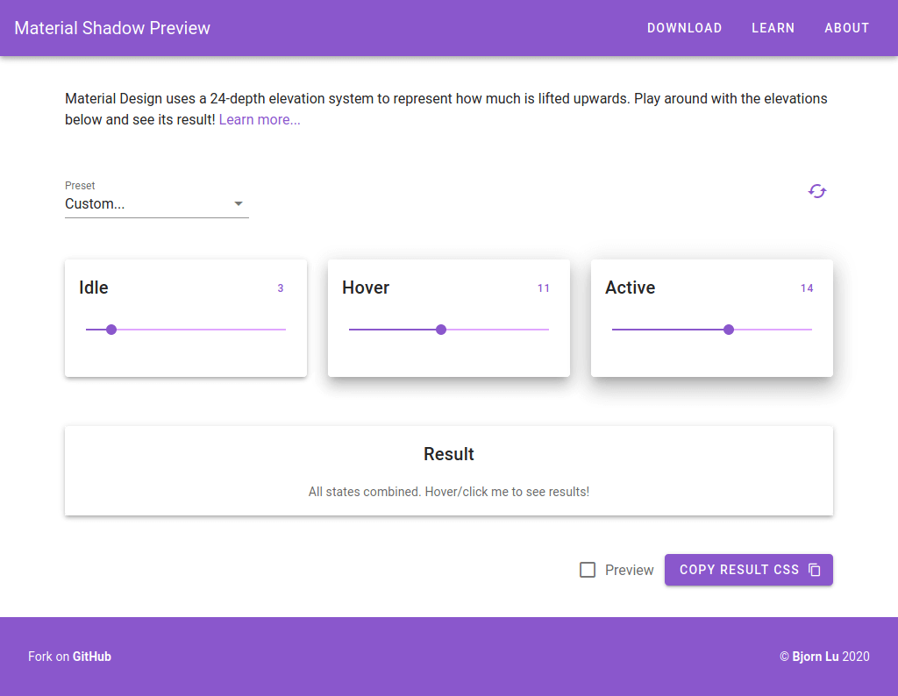

An app to visualize Material Design elevations (shadows) and dynamically generate its CSS.

<!-- endexcerpt -->

## What I've Learned

This was my first serious project with Vue. I initially started off without a UI framework, but as the components get more complex, it became time-consuming to re-invent the wheel so I opt for [Vuetify](https://vuetifyjs.com) instead.

The trickiest part at the time was to display the apply syntax highlighting and to enable copy and download functionality. Alas, they are solved with [Highlight.js](https://highlightjs.org) and some JavaScript sorcery.

## Preview

