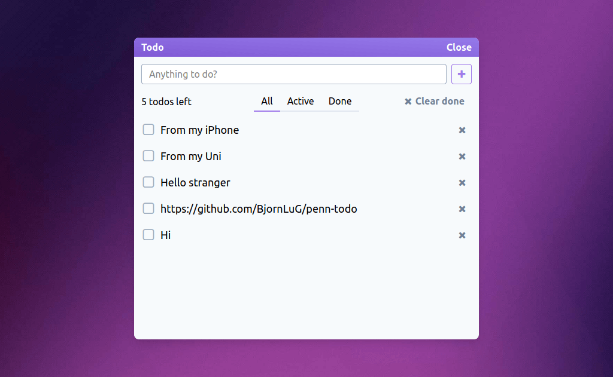

A todo app built on the PENN stack (PostgreSQL, Express, Nuxt, Node.js). It offers custom email authentication and simple todos management.

## What I've Learned

After having much experience with frontend work, this project provided some great insight on how backend communicates with the client and how it works with a database.

Moreover, I also wrote tests using Jest to familiarize myself with test-driven development (TDD). Besides, I practiced documenting the README more, which helps in the long run.

## Preview

