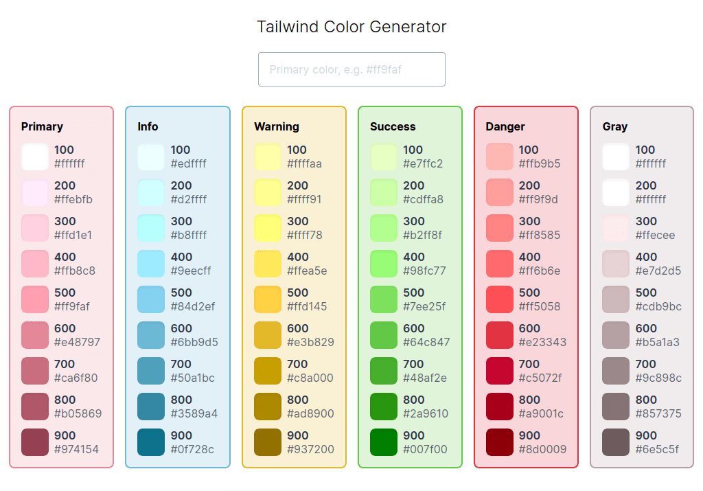

A simple app to quickly generate color palette for Tailwind usage. Includes 100 - 900 shades for primary, info, warning, success, danger and gray colors.

<!-- endexcerpt -->

## What I've Learned

While developing this website, I wanted to quickly generate a set of colors for Tailwind. I've set up this project to test my speed in developing a simple SPA, which overall took me 2 days to finish a working setup. With the help of [Vue CLI](https://cli.vuejs.org), the initial scaffold was a breeze. The part where took me the longest would be setting up [Vue highlight.js](https://github.com/gluons/vue-highlight.js) which was imcompatible with the recent major release of [Highlight.js](https://github.com/highlightjs/highlight.js).

## Preview

