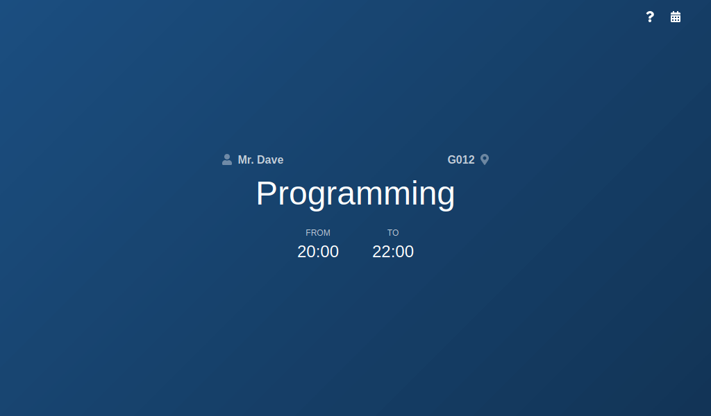

A progressive web app to schedule my classes and other routine activities. No login required as it uses web storage. It works offline as well.

<!-- endexcerpt -->

## What I've Learned

I started this project to learn about building progressive web apps. With [Vue CLI](https://cli.vuejs.org)'s PWA support, it was trivial to setup a project. Besides the usual Vue development, I learned more about service workers and how it works.

I also paid more attention to web manifests. Although it's not PWA-specific, I found out how web manifests can be used to provide alternative images for different platforms and work as a flexible favicon.

## Preview

